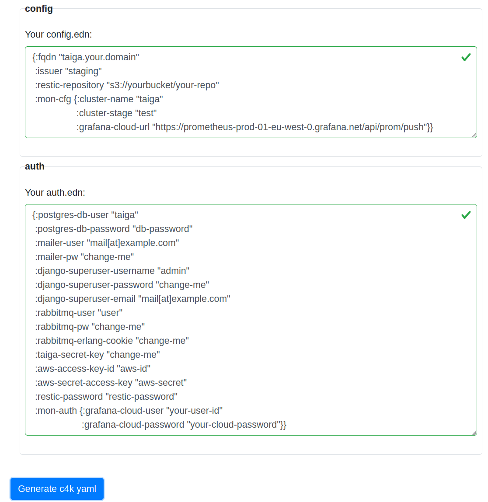

# convention 4 kubernetes: c4k-taiga

[](https://clojars.org/org.domaindrivenarchitecture/c4k-taiga) [](https://gitlab.com/domaindrivenarchitecture/c4k-taiga/-/commits/main) 

[ chat over e-mail](mailto:buero@meissa-gmbh.de?subject=community-chat) | [ team@social.meissa-gmbh.de](https://social.meissa-gmbh.de/@team) | [taiga & Blog](https://domaindrivenarchitecture.org)

## Requirements

https://github.com/kaleidos-ventures/taiga-docker
https://community.taiga.io/t/taiga-30min-setup/170

Note: taiga-manage,-back und -async verwenden die gleichen img
mit unterschiedlichen entry-points

### HTTPS

Terminiert am ingress. Wie interagiert das mit taiga?
Eventuell wird dies hier relevant:
https://github.com/kaleidos-ventures/taiga-docker#session-cookies-in-django-admin

### **Docker Compose -> Kubernetes**

compose -> kubernetes yaml
Funktionieren yaml anchors in kubernetes?
Ja, in der selben file.

### Für das init deployment

Reicht ein init-container im deployment?

* taiga-manage

Einen admin-user anlegen:
https://github.com/kaleidos-ventures/taiga-docker#configure-an-admin-user

folglich:

https://docs.djangoproject.com/en/4.2/ref/django-admin/#django-admin-createsuperuser

Also DJANGO_SUPERUSER_TAIGAADMIN und DJANGO_SUPERUSER_PASSWORD
sollten für den container gesetzt sein.

Dann noch ein run befehl mit:
python manage.py createsuperuser

Vielleicht 

### Für das deployment

* taiga-db
* Postgres
* taiga-back
* taiga-async
* taiga-async-rabbitmq
* taiga-front
* taiga-events
* taiga-events-rabbitmq
* taiga-protected
* taiga-gateway
  * Nginx???
  * ersetzen durch metallb und ingresse

### **Volume Mounts**

* taiga-static-data:
* taiga-media-data:
* taiga-db-data:
* taiga-async-rabbitmq-data:
* taiga-events-rabbitmq-data:

### **Secrets**

* admin user?
* secret-key
* db
* email
* rabbit-mq

## Purpose

## Status

## Try out

Click on the image to try out in your browser:

[](https://domaindrivenarchitecture.org/pages/dda-provision/c4k-taiga/)

Your input will stay in your browser. No server interaction is required.

You will also be able to try out on cli:
```
target/graalvm/c4k-taiga src/test/resources/taiga-test/valid-config.yaml src/test/resources/taiga-test/valid-auth.yaml | kubeval -
target/graalvm/c4k-taiga src/test/resources/taiga-test/valid-config.yaml src/test/resources/taiga-test/valid-auth.yaml | kubectl apply -f -
```


## Usage

You need:

...

* and a kubernetes cluster provisioned by [provs]

...
Let c4k-taiga generate your .yaml file.  
Apply this file on your cluster with `kubectl apply -f yourApp.yaml`.  
Done.

### resource requests and limits

You may want to adjust the resource requests and limits of the build and init containers to your specific scenario.

## Development & mirrors

Development happens at: https://repo.prod.meissa.de/meissa/c4k-taiga

Mirrors are:

* https://gitlab.com/domaindrivenarchitecture/c4k-website (issues and PR, CI)

For more details about our repository model see: https://repo.prod.meissa.de/meissa/federate-your-repos

## License

Copyright © 2022 meissa GmbH
Licensed under the [Apache License, Version 2.0](LICENSE) (the "License")
Pls. find licenses of our subcomponents [here](doc/SUBCOMPONENT_LICENSE)

[provs]: https://gitlab.com/domaindrivenarchitecture/provs/
